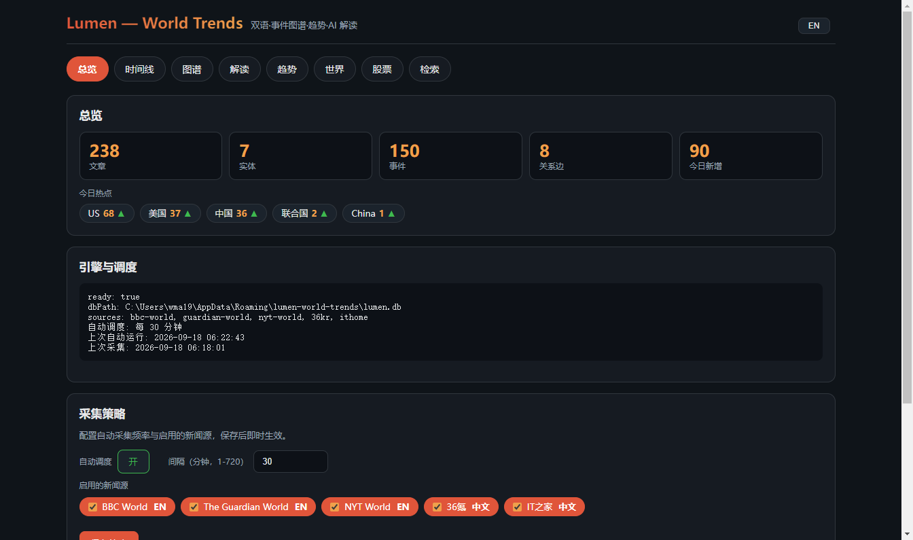
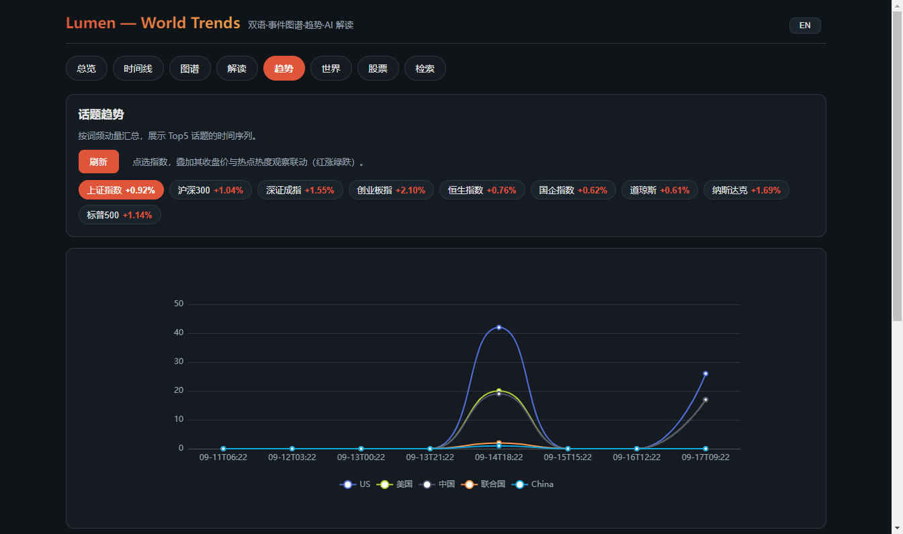
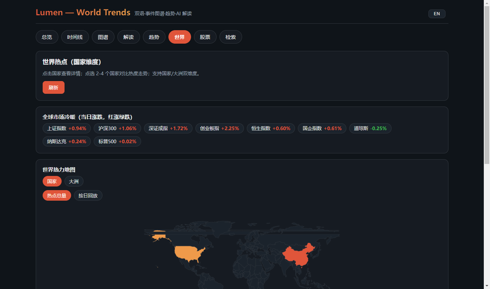
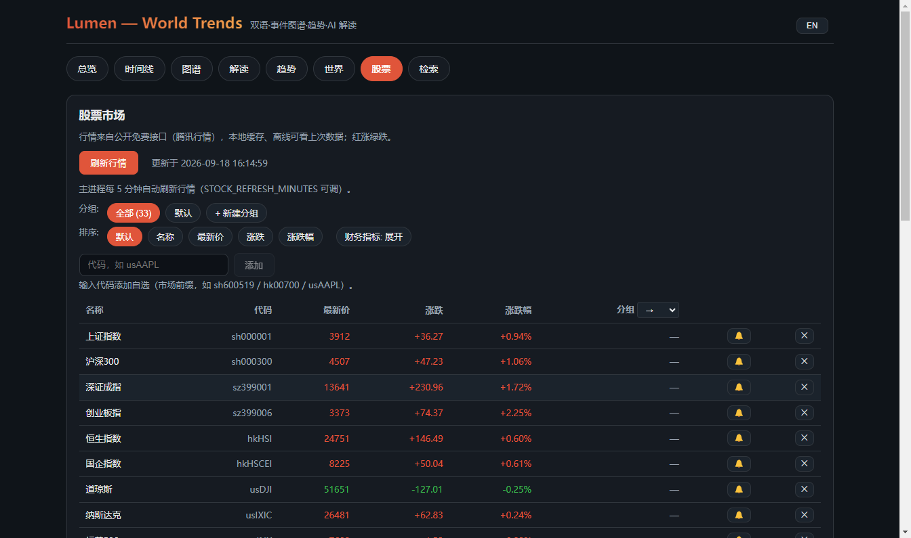
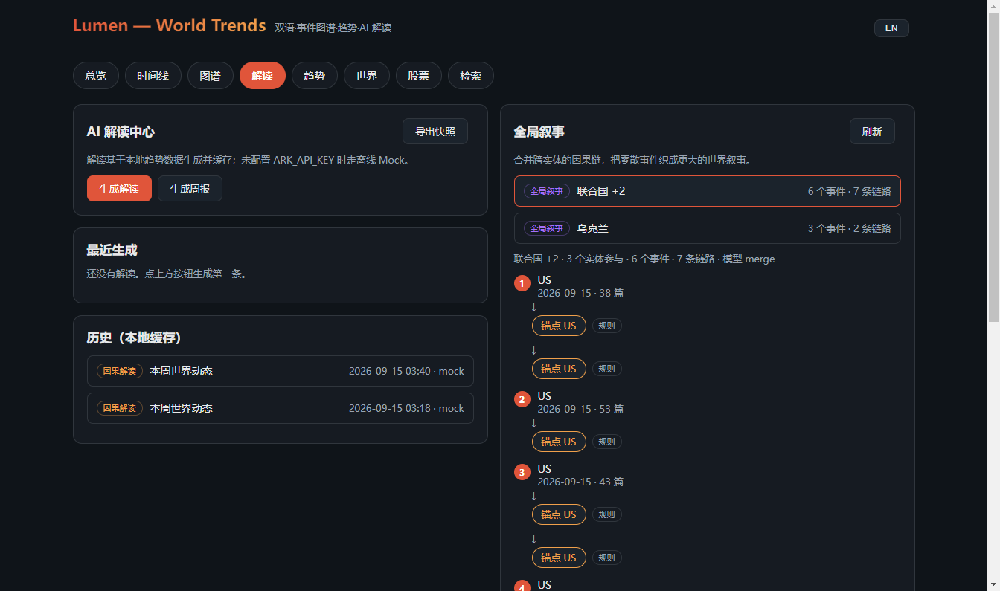
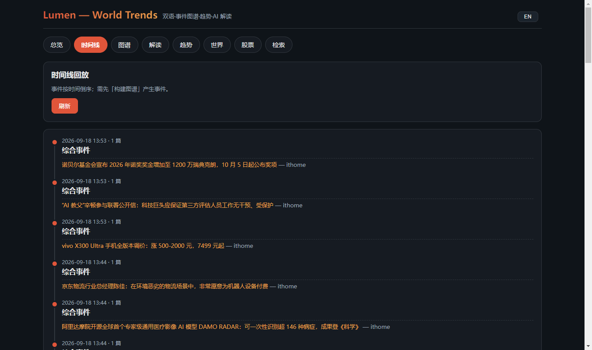
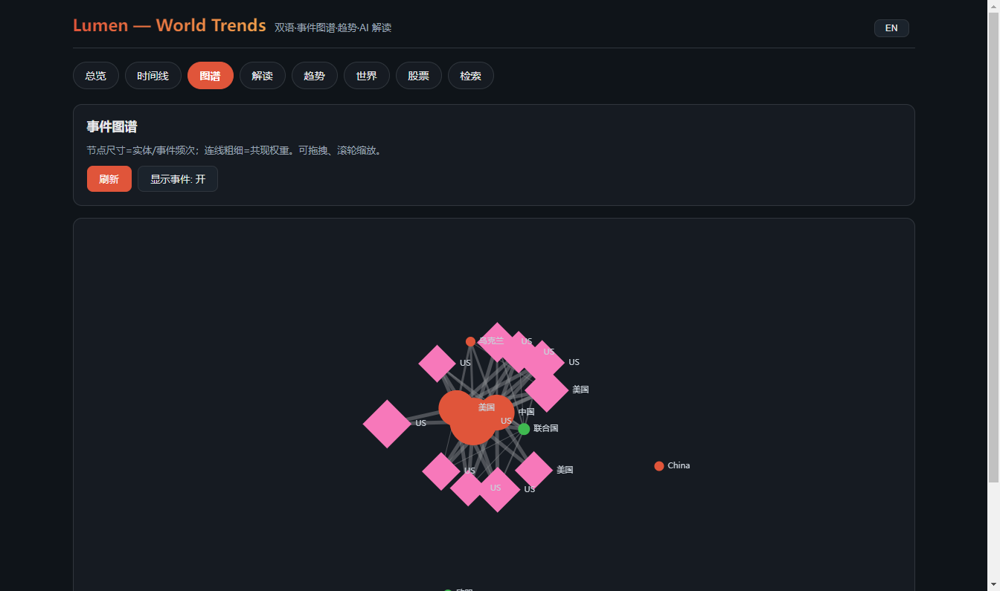
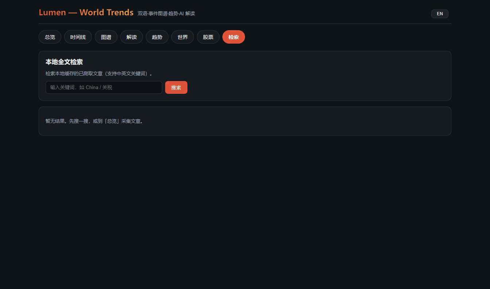

# Lumen — World Trends

一个**纯客户端、无服务端的双语热点台**：持续抓取全球热点新闻，用**事件图谱**表达世界元素间的关系，用**趋势引擎**量化话题的变动，用 **AI 因果解读**讲清“世界为什么在变”，全部数据**本地缓存、可离线回看/检索**。

> 名字 *Lumen* 取意“光”，寓意照亮世界趋势。

---

## ✨ 特性

- **双语聚合**：内置五路 RSS（BBC World / The Guardian World / NYT World / 36氪 / IT之家），中英双语；界面支持一键中/英切换。
- **事件图谱**：实体抽取（词典 gazetteer）→ 共现关系 → 共享实体聚类成事件，落库为 entity / event / edge。
- **趋势引擎**：按时间桶计算话题热度序列、动量（涨/跌）、世界热点（国家维度）。
- **AI 因果解读**：对最热话题生成中文因果解读；provider 可插拔（火山方舟 ARK / Mock）。
- **因果链**：输入任意实体，把其相关事件按时间串成链路（共享实体作锚点），可选 AI 逐段补因果断言 + 整体摘要。
- **全局叙事**：把跨实体的因果链按共享事件自动合并成更大的叙事（如“制裁 China → 油价 Oil → 通胀 US”），从局部链到世界叙事一张图；支持一键 **AI 整体摘要** 与 **反事实推演**（“如果首个事件没有发生会怎样”）。
- **解读中心体验**：AI 解读 / 因果链双栏布局；新手三步引导（采集→建图→生成）；一键导出 Markdown/JSON 快照。
- **桌面看板**：7 个 Tab（总览 / 时间线 / 图谱 / 解读 / 趋势 / 世界 / 检索）。
- **总览数据**：文章/实体/事件/关系边/今日新增指标卡 + 今日热点 + 调度状态（`dashboard:today`）。
- **AI 解读中心**：因果解读 + 周报生成 + 实体因果链，历史本地缓存。
- **时间线回放**：把聚类出的事件按时间倒序组织成可回看的时间线，附其关联文章。
- **事件图谱可视化**：以力导向图展示实体节点与共现边，可开/关事件节点（菱形）+ 事件→实体边，可拖拽、滚轮缩放。
- **自动调度**：冷启动即自行跑一轮「采集→图谱→趋势」，此后每 30 分钟自动刷新（`LUMEN_INTERVAL_MINUTES` 可调）。
- **双语界面**：中文/English 一键切换，选择本地记忆（`src/i18n/`，零新依赖）。
- **世界热力地图**：世界 GeoJSON choropleth（110m），国家热度着色、可缩放拖动，点击区域联动国家详情/对比。
- **世界按日回放**：把最近 14 天按「每篇文章的日期」拆成日级热度，地图可播放/暂停/拖动时间轴回看世界热度的逐日演变。
- **大洲聚合视图**：世界 Tab 「国家 / 大洲」双维度一键切换；大洲模式地图按所在洲总热度着色、榜单改显洲级热度，回放同样支持洲级逐日演变（`src/world/regions.ts`，8 洲静态映射，零依赖）。
- **股票行情 Tab**：指数/A股/港股/美股约 33 个内置标的 + **自选股可增删**（输入市场前缀代码，如 `usAAPL`/`hk00700`，添加前经行情接口校验；腾讯公开行情 qt.gtimg.cn + ifzq.gtimg.cn，无需 API Key），报价表 + ECharts K 线（**日K/周K/月K**、红涨绿跌、可缩放），**每 5 分钟自动刷新**（`STOCK_REFRESH_MINUTES` 可调）与本地缓存离线可看上次行情。
- **市场×趋势联动**：趋势 Tab「大盘与热点联动」把指数收盘价（右轴）叠加到 Top 热点热度（左轴）同一时间轴（缺失交易日断线）；世界 Tab「全球市场冷暖」展示上证/恒生/纳指等 9 大指数当日涨跌（红涨绿跌）——全部由本地行情缓存驱动。
- **本地缓存**：SQLite 落盘（`sql.js`），采集/建图/解读后与退出前自动持久化，离线可回看/检索。
- **无服务端**：主进程 Node 完成采集/图谱/趋势/AI，渲染层仅展示；二者只走 Electron IPC，不监听任何端口。
- **采集策略（UI 可配）**：总览 Tab 可勾选启用的新闻源、开关自动调度、调间隔（1-720 分钟），保存后即时生效并落库持久化（`settings:get` / `settings:update`）。

## 截图一览

下面 8 张截图按 7 个 Tab 的顺序展示 Lumen 看板的真实使用效果。

### 总览 Tab — 指标卡 + 引擎状态 + 采集策略



仪表盘入口：5 张核心指标卡（文章 / 实体 / 事件 / 关系边 / 今日新增）+ 今日热点 chips + 引擎调度状态（`ready`/`dbPath`/`sources`/`自动调度`/`上次/下次自动运行`）+ **采集策略** UI（启用的新闻源勾选 + 自动调度开关 + 间隔分钟 1–720，保存即生效）。点「手动采集 / 构建图谱」即可触发 `collector:manualRun` / `graph:build`。

### 趋势 Tab — Top5 话题热度 + 大盘与热点联动



顶部 chip 列出 9 大指数当日涨跌（红涨绿跌）；点选指数后 ECharts 把「指数收盘价」叠加到 Top5 话题热度同一时间轴上（双 Y 轴，缺失交易日断线），把"市场冷暖"与"舆论热度"一眼对位。

### 世界 Tab — 国家/大洲双维度 + 按日回放 + 全球市场冷暖



Choropleth 热力地图按国家（或大洲）热度着色，左上「国家 / 大洲」一键切换；顶部是 9 大指数当日涨跌条（**全球市场冷暖**）；支持**按日回放**最近 14 天的世界热度演变，可播放/暂停/拖时间轴。点击国家出下拉集显国家详情与 2-4 国对比折线。

### 股票 Tab — 自选股报价 + 日/周/月 K 线



报价表：名称 / 代码 / 最新价 / 涨跌 / 涨跌幅（红涨绿跌）；可输入市场前缀代码（如 `usAAPL` / `hk00700` / `sh600519`）**校验后增删**自选股；点击行打开 **ECharts K 线**（日K / 周K / 月K 切换 + 成交量副图 + 滚轮缩放）。主进程每 5 分钟自动刷新（`STOCK_REFRESH_MINUTES` 可调），本地缓存保证离线仍能看上次行情。

### 解读 Tab — AI 解读中心 + 全局叙事



左栏 **AI 解读中心**：一键「生成解读 / 生成周报」+ 历史本地缓存，未配置 `ARK_API_KEY` 自动走离线 Mock；右栏 **全局叙事**：自动合并跨实体因果链，把零散事件组织成更大的世界叙事（如"制裁 China → 油价 Oil → 通胀 US"），并支持一键 AI 摘要 / 反事实推演。

### 时间线 Tab — 事件按时间倒序回看



把聚类出的事件按时间倒序组织成可回看的时间线，每条事件列出标题 + 来源（IT之家 / 36氪 / BBC / Guardian / NYT），点击关联文章即可跳读原文；先在「总览」跑一次「构建图谱」即可产生事件。

### 图谱 Tab — 实体节点 + 事件节点 + 共现边



力导向图：圆点 = 实体（按频次着色与大小），菱形 = 事件，连线粗细 = 共现权重。可拖拽节点、滚轮缩放；顶部「显示事件」按钮一键切换事件层可见性，把世界的关系网一眼摊开。

### 检索 Tab — 本地全文检索



跨中英文关键词检索已抓文章，结果全部来自本地 SQLite（`sql.js`），离线可用；空结果时会提示「先搜一搜，或到「总览」采集文章」。

## 架构

```
可视化层 (React + Vite + ECharts)          ← Electron IPC（非 HTTP）→
主进程 (Electron Main / Node/TS)
   ├─ 采集 collector (rss / html 适配器)
   ├─ 图谱 graph (entity/event/edge + 聚类)
  ├─ 趋势 trends (时间序列 / 动量 / 热力)
  ├─ 股票 stocks (行情抓取 / 解析 / K线)
  ├─ 因果 causal (规则链构建 + 跨链合并 + AI 断言)
   ├─ 导出 export (快照 Markdown/JSON)
   └─ AI ai (ARK / Mock 可插拔 provider)
数据层: SQLite (sql.js)  →  %APPDATA%\lumen-world-trends\lumen.db
```

单向流水线：`采集 → 标准化去重 → 图谱入库 → 趋势 → 因果链/全局叙事 + AI 解读 → IPC → 展示`

## 技术栈

| 层 | 选型 |
|---|---|
| 桌面壳 | Electron |
| 前端 | React + Vite + TypeScript |
| 图表 | ECharts |
| 采集 | axios / cheerio / rss-parser |
| 存储 | sql.js（SQLite WASM，零原生编译） |
| 测试 | vitest（全夹具，不发真实网络） |
| AI | OpenAI 兼容（火山方舟 ARK / Mock） |

## 环境要求

- Node.js ≥ 18（建议 20+）
- 本机 CMake 无关：依赖无原生编译，通常无需 VS 构建工具

## 安装与运行

```bash
# 1) 安装依赖
npm install

# 2) 开发模式（Vite + Electron，会弹桌面窗口）
npm run dev

# 3) 生产构建
npm run build

# 4) 运行测试
npm test
```

> 提示：国内网络下载 Electron 二进制如果不畅，可先设置镜像源：
> ```powershell
> $env:ELECTRON_MIRROR="https://npmmirror.com/mirrors/electron/"
> npm install
> ```

## 看板使用（开箱）

启动后顶部有 7 个 Tab（均读本地缓存，离线可用）：

- **总览**：指标卡（文章/实体/事件/边/今日新增）+ 今日热点 chips + 引擎与调度状态 + 操作按钮
  - **采集策略**：启用的新闻源勾选开关 + 自动调度开/关 + 间隔分钟，保存即生效（`settings:get` / `settings:update`）
  - `手动采集`：抓取当前启用的源（`collector:manualRun`）
  - `构建图谱`：对最新文章抽实体/聚类/建边（`graph:build`）
- **趋势**：top 话题热度折线 + **大盘与热点联动**（选指数，双 Y 轴叠加收盘价与热度；`topics:list` + `stocks:history`）
- **世界**：国家热点榜单 + 点击查看国家详情（关联话题/文章）+ 2-4 国热度对比折线 + 地图**按日回放**（播放/暂停/滑块）+ **国家/大洲双维度** + **全球市场冷暖**条（9 大指数当日涨跌；`countries:detail` / `countries:series` / `world:timeline` / `stocks:list`）
- **股票**：自选股报价表（名称/代码/最新价/涨跌/涨跌幅，红涨绿跌；可添加/移除代码，`stocks:watch` / `stocks:add` / `stocks:remove`）+ 点击行看 K 线（**日K/周K/月K** 切换 + 成交量副图 + 缩放，`stocks:history`），带「刷新行情」、5 分钟自动刷新与本地缓存（`stocks:list` / `stocks:refresh`）
- **检索**：本地全文搜索已抓文章（`search:fulltext`）
- **时间线**：事件按时间倒序回放，含关联文章（`timeline:replay`）
- **图谱**：实体节点 + 共现边 + 可开关的事件节点（`graph:query`）
- **解读**：AI 因果解读 / 周报生成 + 历史记录（`insights:generate` / `insights:weekly` / `insights:list`）
  - **全局叙事**：自动合并跨实体链，点击查看整条叙事；可一键生成 **AI 摘要** 与 **反事实推演**（`causality:narratives` / `causality:summarize` / `causality:counterfactual`）
  - **因果链**：输入实体名（如 China / 关税）生成事件链，可开/关 AI 断言，历史可回看（`causality:generate` / `causality:list` / `causality:chain`）
  - **三步引导**：无数据时顶部出现新手指引，可直接「去采集 / 去建图」
  - **导出快照**：一键导出 Markdown/JSON 快照（趋势 + 解读 + 因果链 + 全局叙事，系统保存对话框）（`export:snapshot`）

## 启用真实 AI（火山方舟 ARK）

默认无 `ARK_API_KEY` 时走 **Mock**（离线兜底，返回占位解读/规则因果链）。配置真实 ARK：

```powershell
# PowerShell
$env:ARK_API_KEY = "<你的 ARK API Key>"
$env:ARK_BASE_URL = "https://ark.cn-beijing.volces.com/api/v3"  # 可选
$env:ARK_MODEL = "ep-xxxxxxxx | doubao-seed-1-6-250615"        # 可选
npm run dev
```

```bash
# macOS / Linux
export ARK_API_KEY="<你的 ARK API Key>"
export ARK_MODEL="ep-xxxx"   # 可选
npm run dev
```

- 鉴权：`Authorization: Bearer <ARK_API_KEY>`
- 端点：`{ARK_BASE_URL}/chat/completions`
- 支持传入模型 id 或推理接入点 `ep-*`

## 命令与脚本

| 命令 | 作用 |
|---|---|
| `npm run dev` | 开发运行（Vite + Electron） |
| `npm run build` | 生产构建（renderer + electron main + 拷贝 preload） |
| `npm run build:main` | 仅构建 electron 主进程 |
| `npm test` | 运行全部 vitest 测试（夹具，不发网络） |
| `npx tsc -p tsconfig.json --noEmit` | 类型检查 |
| `npm run capture:shots` | 一键捕获 8 个 Tab 的 PNG 到 `images/`（截图工具脚本，详见下方「开发工具：截图捕获」） |

开发辅助环境变量（非必须）：

- `LUMEN_SMOKE=1`：自动加载后打印引擎状态并退出（冒烟自检）
- `LUMEN_INTERVAL_MINUTES`：自动调度间隔兜底值（分钟，默认 30；已在 UI「采集策略」配置后以 UI 为准）
- `STOCK_REFRESH_MINUTES`：股票行情自动刷新间隔（分钟，默认 5）
- `LUMEN_DEBUG=1`：打印渲染层 DOM/console 便于排查白屏
- `LUMEN_CAPTURE=1`：配合 `capture:shots` 启用截图模式（脚本已自动设，**一般不用手设**）
- `LUMEN_CAPTURE_DIR`：自定义截图输出目录（默认 `images/`）

## 开发工具：截图捕获

> 用于给 README / 文档 / 发布稿生成 8 个 Tab 的 PNG。

```bash
npm run capture:shots
```

- **做什么**：先 `npm run build`，再以 `LUMEN_CAPTURE=1` 启动 Electron；窗口加载完成后，主进程自动遍历 8 个 nav-btn → `executeJavaScript` 切 Tab → 等 2600ms 让图表/地图渲染 → `webContents.capturePage()` 截图 → 写 `<tab>.png`，完成后自动 `app.quit()`。
- **输出目录**：默认 `images/`（仓库根）；可设 `LUMEN_CAPTURE_DIR` 改路径，目录会自动 `mkdir -p`。
- **顺序**：固定为 `dashboard / timeline / graph / insights / trends / world / stocks / search`，与上方「截图一览」章节顺序一致。
- **Git 策略**：**工具本身入源码，PNG 产物不入库**（`.gitignore` 已配 `images/`）；首次克隆后跑一次 `capture:shots` 即可在本地复现上方的 8 张截图。
- **CI**：本工具是开发辅助，**不在 CI 自动跑**（需要桌面 Electron 环境）；只在发版前手跑一次刷新文档。
- **注意事项**：
  - 必须先 `npm run build`，因为脚本依赖 `dist/` + `dist-electron/` 产物。
  - 每个 Tab 等 2600ms 是为图表/地图就绪的保守值；如果图表特别慢，可适当调长（修改 `electron/main/capture.ts` 的 `sleep(2600)`）。
  - 暂只截可视区；如果某个 Tab 很长（如时间线/图谱），未来可改为整页截图（`capturePage()` 默认是可视区，需结合 `webContents.setVisualZoomLevelLimits` 等扩展）。

## 项目结构

```
lumen/
  electron/main/         # 主进程
    collectors/          # 采集适配器 (rss/html) + 源注册表
    extract/             # 实体词典 (gazetteer)
    graph/               # 聚类 / 关系 / 图谱仓储 / buildGraph
    trends/              # 趋势引擎 / 热力 / 实体时序
    causal/              # 因果链构建 (规则) + 跨链合并 (merge) + AI 断言 + 仓储
    export/              # 快照导出 (Markdown/JSON)
    world/               # 国家详情 / 多国对比 / 按日回放时间线（countries:* / world:timeline）
    stocks/              # 行情 watchlist / 腾讯&Mock provider（stocks:*）
    db/                  # sql.js 连接 / 迁移 / 持久化 + 股票缓存/自选股
    ai/                  # provider(ARK/Mock) + 解读器
    dash/                # 总览汇总（dashboard:today）
    db/                  # sql.js 连接 / 迁移 / 持久化
    ipc/                 # IPC handlers
    index.ts             # 入口
  src/                   # 渲染层 (React)
    components/          # 总览 / 时间线 / 图谱 / 解读 / 趋势 / 世界 / 检索
    world/               # 世界地图 GeoJSON 归一化 + 大洲聚合（geo / regions）
    stocks/              # 市场×趋势叠线辅助（overlay）
    i18n/                # 中/英字典 + Provider(hook)
    hooks/               # useInvoke / useEngineStatus
  resources/             # 世界 GeoJSON（110m，生成物）
  shared/                # 主/渲染共享类型与契约
  tests/                 # vitest 夹具测试
  docs/superpowers/      # specs + 里程碑计划 + 交付记录
```

## 测试

- 单元/集成测试全用 **fixture**（RSS/HTML 字符串、内存 SQLite），**不依赖真实网络**。
- `npm test` 覆盖：契约、数据层、采集适配（含中文 RSS）、图谱聚类/仓储、趋势引擎、总览汇总、国家详情/对比、世界按日时间线、大洲聚合映射、股票解析/缓存/自选股、市场×趋势叠线对齐（fixture+Mock，不发网络）、i18n 字典、AI provider/解读（含周报）、insight 仓储、因果链（规则构建/AI 断言/仓储）、跨链合并/全局叙事、叙事 AI 摘要/反事实推演、采集策略设置（持久化/过滤/钳制）、快照导出（Markdown/JSON）、检索。
- 真实抓取/真实 ARK 由你在应用里点按钮触发，不在 CI 中验证（本机网络对 GitHub 等不稳）。

## 局限与路线图

- **中文热点站（微博/知乎等）**：依赖 JS 渲染 + 反爬，当前未接；下一步可用无头浏览器型采集器适配。
- **世界热力地图**：已实现 choropleth（110m 粒度）+ 按日回放 + 国家/大洲双维度（大洲映射为精选列表，缺省落入「其他」，可在 `src/world/regions.ts` 扩充）；更细行政区可换用 50m GeoJSON 重生成（`scripts/gen-world-geo.mjs`），回放可扩展为周/月档与动画插帧。
- **实体识别**：当前为词典 + 句法匹配；可升级为本地 NLP 或交给 AI 做更细抽取与上下位关系。
- **图谱**：关系类型 v1 仅 `co-occurrence`；真正的因果/包含关系交给 AI 解读阶段。
- **因果链**：v1 基于共享实体的时间相邻锚点，AI 断言可选；v2 支持跨实体合并成全局叙事 + AI 摘要 + 反事实推演；下一步可做时序因果/影响量化。
- **导出快照**：v1 为 Markdown/JSON 全文导出；可扩展为图表 PNG、订阅式自动归档。
- **股票行情**：行情来自腾讯公开接口（第三方免费源，可能限流/变更）；已支持自选股增删、日/周/月 K 与 5 分钟自动刷新；下一步可做自选分组/排序、财务指标、涨跌幅排序与预警。
- **AI**：解读聚焦最热话题（≤400 字）；可按需扩展周报/月报样式与模型切换。

## IPC 契约一览

主/渲染经 `shared/contracts.ts` 统一定义渠道：`engine:status` `dashboard:today` `collector:manualRun` `graph:build` `topics:list` `insights:generate` `insights:list` `insights:weekly` `causality:list` `causality:generate` `causality:chain` `causality:narratives` `causality:summarize` `causality:counterfactual` `export:snapshot` `settings:get` `settings:update` `search:fulltext` `graph:query` `timeline:replay` `countries:detail` `countries:series` `world:timeline` `stocks:list` `stocks:refresh` `stocks:history` `stocks:watch` `stocks:add` `stocks:remove`。

## 授权说明

本仓库专注“爬取公开新闻 → 结构化 → 洞察”的工程质量；请遵守各新闻源的使用条款与所在法律法规，控制抓取频率，尊重版权。
